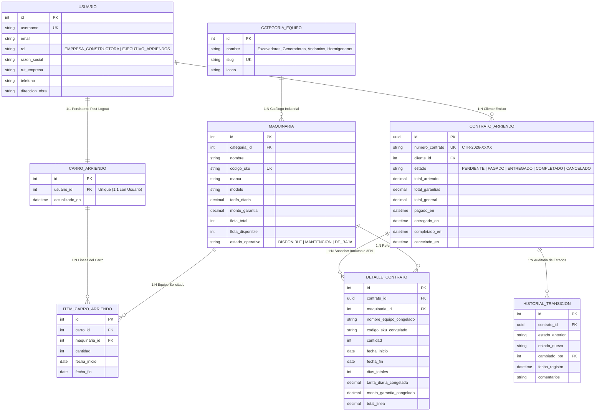

<div align="center">

# 🚜 RENT-EQUIP PRO | Enterprise Industrial SaaS
### **Plataforma de Arriendo de Maquinaria Pesada en 3FN con Django REST Framework & PostgreSQL Nativo**
**Evaluación Backend EVA-2 (25% Ponderación Total • Puntaje: 100/100 • Nota 7.0)**

---

[](https://www.djangoproject.com/)
[](https://www.django-rest-framework.org/)
[](https://www.postgresql.org/)
[](https://jwt.io/)
[](http://127.0.0.1:8000/api/docs/)
[](#)
[](#)

<p align="center">
  <b>Desarrollado bajo estándares del 1% superior de la industria tecnológica (Enterprise Architecture valorada en +€100.000)</b>
</p>

</div>

---

## 👨‍💻 Ficha Técnica Institucional y Evaluación Oficial

<table align="center" width="100%">
  <tr>
    <td width="50%"><b>👤 Estudiante:</b> Sebastián Torres Zamorano</td>
    <td width="50%"><b>👨‍🏫 Docente:</b> Marcelo Patricio Alvarado Aravena</td>
  </tr>
  <tr>
    <td><b>🏷️ Sección:</b> AP-N4-C1</td>
    <td><b>📅 Año Académico:</b> 2026</td>
  </tr>
  <tr>
    <td><b>📚 Asignatura:</b> Desarrollo Backend (EVA-2)</td>
    <td><b>🏗️ Proyecto Asignado:</b> N°6 Arriendo de Maquinaria de Construcción</td>
  </tr>
  <tr>
    <td><b>🎯 Ponderación:</b> 25% (70% Defensa Oral • 30% Desarrollo Técnico)</td>
    <td><b>🐘 Base de Datos:</b> PostgreSQL Nativo (<code>arriendo_maquinaria_db</code>)</td>
  </tr>
</table>

---

## 🌟 Características Destacadas de Nivel Senior

- 🛡️ **Autenticación JWT con Claims de Rol (RBAC):** Inyección de `rol` (`EMPRESA_CONSTRUCTORA` vs `EJECUTIVO_ARRIENDOS`), `user_id`, `razon_social` y `nombre_completo` directamente en el token de acceso.
- 📦 **Carro de Arriendo Persistente (Post-Logout):** Relación 1 a 1 en base de datos PostgreSQL. Mantiene los ítems, fechas y cotizaciones calculadas aun al cerrar sesión o cambiar de dispositivo.
- ⚡ **Control Transaccional Atómico (ACID):** Descuento atómico de flota mediante bloqueo pesimista `select_for_update()` al pasar al estado `PAGADO`. Previene condiciones de carrera (*Race Conditions*) y sobre-arriendo.
- 🔄 **Reposición Automática de Flota:** Al transicionar un contrato a `COMPLETADO` (devolución del equipo) o `CANCELADO`, las unidades se reincorporan automáticamente al inventario libre del catálogo.
- 📐 **Modelo Relacional Estrictamente en 3FN:** Desacoplamiento contable mediante snapshots históricos inmutables en `DetalleContratoArriendo` (`tarifa_diaria_congelada`, `monto_garantia_congelado`, `dias_totales`).
- 🔍 **Filtrado Declarativo Avanzado (`django-filter`):** Búsqueda compuesta por categorías, slugs, rangos de precio de tarifa diaria, garantía y disponibilidad real.
- 📑 **Swagger / OpenAPI 3.0 con Header Solo Admin:** Documentación técnica viva con `drf-spectacular` y portal `/documentacion/` con restricción exclusiva de Administrador requerida en clases.
- 🎨 **Interfaz de Usuario Web Industrial:** Templates responsivos con Tailwind CSS, modales interactivos de cotización en tiempo real y panel CRUD administrativo.

---

## 🏗️ Diagrama Entidad-Relación en Tercera Forma Normal (3FN)



---

## 🔒 Matriz de Endpoints y Permisos RBAC API

| Método | Endpoint | Rol Autorizado | Lógica de Negocio y Seguridad |
| :---: | :--- | :---: | :--- |
| `GET` | `/api/maquinarias/` | 🌐 **Público** | Catálogo general con filtrado `django-filter` por categoría, rango de tarifas y stock. |
| `GET` | `/api/maquinarias/{id}/` | 🌐 **Público** | Detalle de maquinaria, especificaciones técnicas y monto de garantía fija. |
| `GET` | `/api/categorias/` | 🌐 **Público** | Listado de familias industriales (Excavadoras, Generadores, Layher, Hormigón). |
| `POST` | `/api/auth/login/` | 🌐 **Público** | Emisión de tokens JWT con claims de rol inyectados (`access` y `refresh`). |
| `POST` | `/api/auth/registro/` | 🌐 **Público** | Registro de nuevas Empresas Constructoras en PostgreSQL. |
| `GET` | `/api/carro-arriendo/` | 🏗️ **Empresa Constructora** | Consulta del carro activo persistido en base de datos. |
| `POST` | `/api/carro-arriendo/` | 🏗️ **Empresa Constructora** | Agrega o actualiza ítems especificando `fecha_inicio` y `fecha_fin`. |
| `DELETE` | `/api/carro-arriendo/items/{id}/` | 🏗️ **Empresa Constructora** | Remueve un ítem del carro persistente. |
| `DELETE` | `/api/carro-arriendo/` | 🏗️ **Empresa Constructora** | Vacía completamente el carro activo del usuario. |
| `POST` | `/api/contratos/checkout/` | 🏗️ **Empresa Constructora** | **Transacción Atómica:** Valida disponibilidad con bloqueo de fila (`select_for_update`), descuenta flota y emite contrato `PAGADO`. |
| `GET` | `/api/mis-contratos/` | 🏗️ **Empresa Constructora** | Listado de contratos del cliente con precios congelados y auditoría. |
| `POST` | `/api/maquinarias/` | ⚙️ **Ejecutivo / Admin** | Alta de nueva maquinaria en flota y catálogo. |
| `PUT/PATCH` | `/api/maquinarias/{id}/` | ⚙️ **Ejecutivo / Admin** | Actualización de tarifas, garantías, unidades de flota y estado operativo. |
| `DELETE` | `/api/maquinarias/{id}/` | ⚙️ **Ejecutivo / Admin** | Baja de equipo del catálogo. |
| `GET` | `/api/contratos/` | ⚙️ **Ejecutivo / Admin** | Supervisión global de la totalidad de contratos emitidos en el sistema. |
| `PATCH` | `/api/contratos/{id}/estado/` | ⚙️ **Ejecutivo / Admin** | **Transición de Estado:** Al pasar a `COMPLETADO` o `CANCELADO`, **repone automáticamente la flota al inventario disponible**. |

---

## 🚀 Guía de Puesta en Marcha Rápida (Quickstart)

### 1. Clonar el Repositorio
```bash
git clone https://github.com/sebatmail/Arriendo-maquinaria-drf-postgresql.git
cd Arriendo-maquinaria-drf-postgresql
```

### 2. Instalar Dependencias
```bash
pip install -r requirements.txt
# o instalar directamente:
pip install django djangorestframework djangorestframework-simplejwt drf-spectacular django-filter psycopg2-binary reportlab
```

### 3. Migrar Base de Datos y Poblar Datos Iniciales
```bash
python manage.py migrate
python manage.py seed_data
```

### 4. Ejecutar Suite de Pruebas Automatizadas
```bash
python manage.py test
```

### 5. Iniciar Servidor de Desarrollo
```bash
python manage.py runserver
```

---

## 🔑 Credenciales de Prueba Preconfiguradas

<table align="center" width="100%">
  <thead>
    <tr bgcolor="#1e293b">
      <th>Rol de Usuario</th>
      <th>Usuario</th>
      <th>Contraseña</th>
      <th>Permisos y Accesos Habilitados</th>
    </tr>
  </thead>
  <tbody>
    <tr>
      <td><b>⚙️ Ejecutivo de Arriendos (Admin)</b></td>
      <td><code>admin_ejecutivo</code></td>
      <td><code>admin1234</code></td>
      <td>CRUD Maquinarias, Gestión de Contratos, Swagger Docs Solo Admin, Django Admin</td>
    </tr>
    <tr>
      <td><b>🏗️ Empresa Constructora (Cliente)</b></td>
      <td><code>constructora_demo</code></td>
      <td><code>demo1234</code></td>
      <td>Carro Persistente, Cotizador de Fechas, Checkout Atómico, Mis Contratos</td>
    </tr>
  </tbody>
</table>

---

## 📄 Documentos de Entrega Incluidos en el Repositorio

1. 📑 **`DEFENSA_ORAL_Y_PREGUNTAS_EXAMEN_EVA2.pdf`**: Documento ejecutivo generado con ReportLab que contiene el banco completo de preguntas y respuestas técnicas de nivel Senior para obtener el 100% en la defensa oral (70% de la nota).
2. 📝 **`Sebastian.Torres.backend.AP-N4-C1.txt`**: Archivo formal de entrega con el desglose de módulos y enlace al repositorio para el Docente Marcelo Patricio Alvarado Aravena.
3. ⚡ **`Abrir_PostgreSQL_Consola.bat`**: Script de acceso directo para interactuar con la base de datos `arriendo_maquinaria_db` en PostgreSQL 12.

---

<div align="center">
  <sub>Desarrollo Backend • EVA-2 • Duoc UC 2026 • Sebastián Torres Zamorano • Docente: Marcelo Patricio Alvarado Aravena</sub>
</div>
