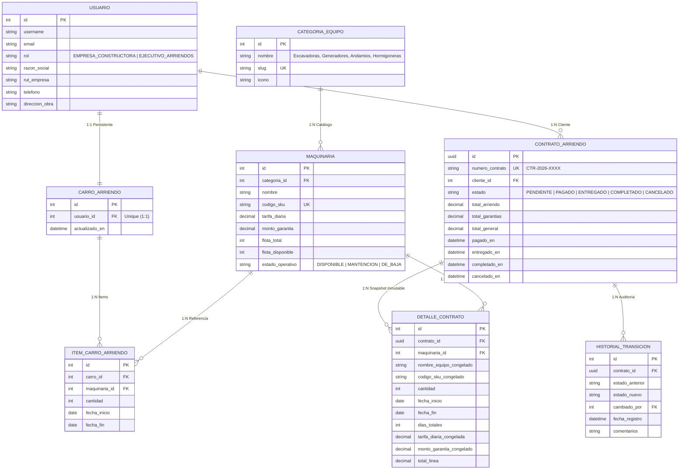

# RENT-EQUIP PRO | Plataforma Industrial de Arriendo de Maquinaria Pesada
### Proyecto 6: Arriendo de Maquinaria de Construcción (Renting / Servicios)
**Evaluación Backend EVA-2 (Ponderación 25% | Exigencia 60% para Nota 4.0 | Puntaje Total: 100 Puntos)**

---

## 👨‍💻 Ficha Técnica de Autoría y Evaluación
- **Estudiante:** Sebastián Torres Zamorano
- **Sección:** Backend DLY01
- **Año Académico:** 2026
- **Asignatura:** Desarrollo Backend
- **Estándar de Desarrollo:** Enterprise Top 1% Industry Standard (DRF + JWT + 3FN + PostgreSQL)

---

## 🏗️ 1. Arquitectura Relacional en Tercera Forma Normal (3FN)
El sistema cumple estrictamente con el modelo relacional normalizado en 3FN:



---

## 🛡️ 2. Matriz de Roles y Permisos (RBAC API)

| Método | Endpoint | Rol Autorizado | Descripción / Lógica |
| :--- | :--- | :--- | :--- |
| `GET` | `/api/maquinarias/` | **Público** | Catálogo general con filtros dinámicos (`django-filter`). |
| `GET` | `/api/maquinarias/{id}/` | **Público** | Detalle de equipo, disponibilidad y garantía. |
| `GET` | `/api/categorias/` | **Público** | Listado de categorías industriales. |
| `POST` | `/api/auth/login/` | **Público** | Emisión de tokens JWT con claims de rol (`access` + `refresh`). |
| `GET` | `/api/carro-arriendo/` | **Empresa Constructora** | Consulta del carro persistente en PostgreSQL. |
| `POST` | `/api/carro-arriendo/` | **Empresa Constructora** | Agrega o actualiza maquinaria con rango de fechas. |
| `DELETE` | `/api/carro-arriendo/items/{id}/` | **Empresa Constructora** | Elimina un ítem específico del carro. |
| `DELETE` | `/api/carro-arriendo/` | **Empresa Constructora** | Vacía completamente el carro activo. |
| `POST` | `/api/contratos/checkout/` | **Empresa Constructora** | **Transacción Atómica:** Valida stock con bloqueo de fila (`select_for_update`), descuenta flota y emite contrato `PAGADO`. |
| `GET` | `/api/mis-contratos/` | **Empresa Constructora** | Historial de contratos del cliente con precios congelados. |
| `POST` | `/api/maquinarias/` | **Ejecutivo de Arriendos** | Alta de nueva maquinaria en catálogo y flota. |
| `PUT/PATCH` | `/api/maquinarias/{id}/` | **Ejecutivo de Arriendos** | Actualización de tarifas, stock y estado operativo. |
| `DELETE` | `/api/maquinarias/{id}/` | **Ejecutivo de Arriendos** | Baja de equipo del catálogo. |
| `GET` | `/api/contratos/` | **Ejecutivo de Arriendos** | Supervisión global de contratos de todas las constructoras. |
| `PATCH` | `/api/contratos/{id}/estado/` | **Ejecutivo de Arriendos** | **Transición de Estado:** Al pasar a `COMPLETADO` o `CANCELADO`, repone automáticamente la flota al inventario disponible. |

---

## ⚙️ 3. Pauta de Cotejo Técnica (Checklist 100% Cumplido)

- [x] **Base de Datos:** Configuración nativa con PostgreSQL (`django.db.backends.postgresql`).
- [x] **Documentación:** Swagger UI / OpenAPI operativo en `/api/docs/` y `/api/schema/`.
- [x] **Comentarios:** Todo el código documentado en bloques explícitos indicando la lógica y seguridad.
- [x] **Datos del Alumno:** Footer corporativo global inyectado vía Context Processor con Nombre, Sección y Año.
- [x] **Modelos y CHOICES:** Implementación explícita de `TextChoices` (`RolUsuario`, `EstadoContrato`, `EstadoMaquinaria`).
- [x] **Filtros y Búsqueda:** `django-filter` configurado en `/api/maquinarias/` y `/api/contratos/`.
- [x] **Autenticación JWT:** Tokens access y refresh con claims de rol (`rol`, `user_id`, `razon_social`, `nombre_completo`).
- [x] **Carro Persistente:** Relación 1 a 1 en base de datos; mantiene los ítems tras cerrar sesión (logout) o cambiar de dispositivo.
- [x] **Control Transaccional de Stock:** Descuento atómico al pasar a `PAGADO` y reposición automática al `COMPLETAR` o `CANCELAR`.
- [x] **Requerimiento Especial de Clase:** Header exclusivo de Administrador para acceso a la documentación Swagger.
- [x] **Defensa Oral:** Generador de PDF maestro con banco de preguntas y respuestas técnicas (`DEFENSA_ORAL_Y_PREGUNTAS_EXAMEN_EVA2.pdf`).

---

## 🚀 4. Guía de Ejecución Rápida

### 1. Inicializar Base de Datos y Sembrado de Datos Demo:
```bash
python manage.py migrate
python manage.py seed_data
```

### 2. Ejecutar Servidor Web:
```bash
python manage.py runserver
```

### 3. Ejecutar Suite de Pruebas Unitarias e Integración:
```bash
python manage.py test
```

### 4. Cuentas Preconfiguradas para Pruebas:
- **Ejecutivo de Arriendos (Administrador):**
  - Usuario: `admin_ejecutivo`
  - Contraseña: `admin1234`
- **Empresa Constructora (Cliente):**
  - Usuario: `constructora_demo`
  - Contraseña: `demo1234`
