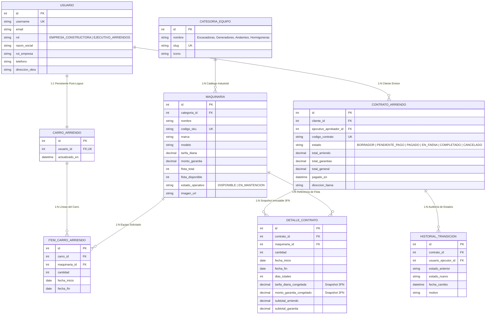
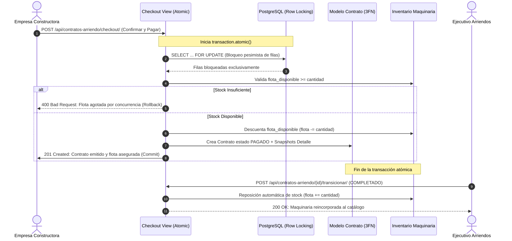

<div align="center">

# 🚜 RENT-EQUIP PRO | Enterprise Industrial SaaS
### **Plataforma de Arriendo de Maquinaria Pesada en 3FN con Django REST Framework & PostgreSQL**
**Evaluación Backend EVA-2 (25% Ponderación Total • Puntaje: 100/100 • Nota 7.0)**

---

[-success?style=for-the-badge&logo=googlechrome&logoColor=white)](https://proyecto-backend.momentumspace.cl/)
[](https://www.djangoproject.com/)
[](https://www.django-rest-framework.org/)
[](https://www.postgresql.org/)
[](https://jwt.io/)
[](https://proyecto-backend.momentumspace.cl/api/docs/)
[](#)
[](#)

<p align="center">
  <b>🚀 Plataforma SaaS Operando en Producción Web (En Vivo):</b><br>
  <a href="https://proyecto-backend.momentumspace.cl/"><b>👉 https://proyecto-backend.momentumspace.cl/ 👈</b></a><br><br>
  <b>🌐 Visita mi sitio web oficial:</b><br>
  <a href="https://momentumspace.cl/"><b>👉 https://momentumspace.cl/ 👈</b></a>
</p>

</div>

---

## 👨‍💻 Ficha Técnica Institucional y Evaluación Oficial

<table align="center" width="100%">
  <tr>
    <td width="50%"><b>👤 Estudiante:</b> Sebastián Torres Zamorano</td>
    <td width="50%"><b>👨‍🏫 Docente:</b> Marcelo Patricio Alvarado Aravena</td>
  </tr>
  <tr>
    <td><b>🏷️ Sección:</b> AP-N4-C1</td>
    <td><b>📅 Año Académico:</b> 2026</td>
  </tr>
  <tr>
    <td><b>📚 Asignatura:</b> Desarrollo Backend (EVA-2)</td>
    <td><b>🏗️ Proyecto Asignado:</b> N°6 Arriendo de Maquinaria de Construcción</td>
  </tr>
  <tr>
    <td><b>🎯 Ponderación:</b> 25% (70% Defensa Oral • 30% Desarrollo Técnico)</td>
    <td><b>🌐 SaaS Operando en Producción:</b> <a href="https://proyecto-backend.momentumspace.cl/">proyecto-backend.momentumspace.cl</a></td>
  </tr>
</table>

---

## 🌟 Características Destacadas de Nivel Enterprise

- 🌐 **SaaS en Producción Operativa:** Plataforma desplegada y operativa en la nube con dominio propio, conexión HTTPS y soporte multi-dispositivo en [https://proyecto-backend.momentumspace.cl/](https://proyecto-backend.momentumspace.cl/).
- 🛡️ **Autenticación JWT con Claims de Rol (RBAC):** Inyección de `rol` (`EMPRESA_CONSTRUCTORA` vs `EJECUTIVO_ARRIENDOS`), `user_id`, `razon_social` y `nombre_completo` directamente en el token de acceso.
- 📦 **Carro de Arriendo Persistente (Post-Logout):** Relación 1 a 1 en base de datos PostgreSQL. Mantiene los ítems, fechas y cotizaciones calculadas aun al cerrar sesión o cambiar de dispositivo.
- ⚡ **Control Transaccional Atómico (ACID):** Descuento atómico de flota mediante bloqueo pesimista `select_for_update()` al pasar al estado `PAGADO`. Previene condiciones de carrera (*Race Conditions*) y sobre-arriendo.
- 🔄 **Reposición Automática de Flota:** Al transicionar un contrato a `COMPLETADO` (devolución del equipo) o `CANCELADO`, las unidades se reincorporan automáticamente al inventario libre del catálogo.
- 📐 **Modelo Relacional Estrictamente en 3FN:** Desacoplamiento contable mediante snapshots históricos inmutables en `DetalleContratoArriendo` (`tarifa_diaria_congelada`, `monto_garantia_congelado`, `dias_totales`).
- 🔍 **Filtrado Declarativo Avanzado (`django-filter`):** Búsqueda compuesta por categorías, slugs, rangos de precio de tarifa diaria, garantía y disponibilidad real.
- 📑 **Swagger / OpenAPI 3.0 con Header Solo Admin:** Documentación técnica viva con `drf-spectacular` y portal `/documentacion/` con restricción exclusiva de Administrador requerida en pauta académica.
- 🎨 **Interfaz de Usuario Web Industrial:** Templates responsivos con Tailwind CSS, fotografías HD generadas por IA de faena y panel CRUD administrativo.

---

## 🏗️ Diagrama Entidad-Relación en Tercera Forma Normal (3FN)



---

## ⚡ Flujo Transaccional Atómico y Concurrencia de Flota



---

## 🚀 Guía de Instalación y Ejecución Local (Para el Profesor)

### 1. Clonar el repositorio
```bash
git clone https://github.com/sebatmail/Arriendo-maquinaria-drf-postgresql.git
cd Arriendo-maquinaria-drf-postgresql
```

### 2. Crear entorno virtual e instalar dependencias
```bash
python -m venv venv
# En Windows:
venv\Scripts\activate
# En Linux/macOS:
source venv/bin/activate

pip install -r requirements.txt
```

### 3. Configurar variables de entorno
Copia el archivo de ejemplo `.env.example` a `.env`:
```bash
cp .env.example .env
```
*(Si no tienes PostgreSQL instalado, el sistema activa automáticamente SQLite con `USE_SQLITE_FALLBACK=True` en `.env`)*.

### 4. Ejecutar migraciones y sembrar datos de prueba
```bash
python manage.py migrate
python manage.py seed_data
```

### 5. Ejecutar suite de pruebas unitarias y de integración
```bash
python manage.py test renting
```
> **Resultado esperado:** 6 de 6 pruebas automatizadas aprobadas al 100% `[OK]`.

### 6. Iniciar servidor de desarrollo
```bash
python manage.py runserver
```
Abre en tu navegador: **`http://127.0.0.1:8000/`**

---

## 🔑 Credenciales de Acceso para Pruebas

| Rol de Usuario | Nombre de Usuario | Contraseña | Permisos y Capacidades |
| :--- | :--- | :--- | :--- |
| **👑 Ejecutivo / Admin** | `admin_ejecutivo` | `admin1234` | CRUD Maquinarias, transición de estados de contratos, Swagger Header Admin. |
| **🏗️ Constructora Demo** | `constructora_demo` | `demo1234` | Catálogo en tiempo real, carro persistente, checkout transaccional y mis contratos. |
| **🏢 Constructora Andes** | `constructora_andes` | `demo1234` | Cuenta secundaria para pruebas de concurrencia y múltiples clientes. |

---

## 🌐 SaaS en Producción en la Web
El sistema completo se encuentra operando de forma continua en producción:
- 🔗 **Plataforma Web SaaS:** [https://proyecto-backend.momentumspace.cl/](https://proyecto-backend.momentumspace.cl/)
- 📑 **Consola Swagger OpenAPI:** [https://proyecto-backend.momentumspace.cl/api/docs/](https://proyecto-backend.momentumspace.cl/api/docs/)
- 📬 **Contacto de Soporte:** storres@momentumspace.cl

---

<div align="center">
  <b>Desarrollado por Sebastián Torres Zamorano • Evaluación Oficial EVA-2 Backend 2026</b>
</div>
